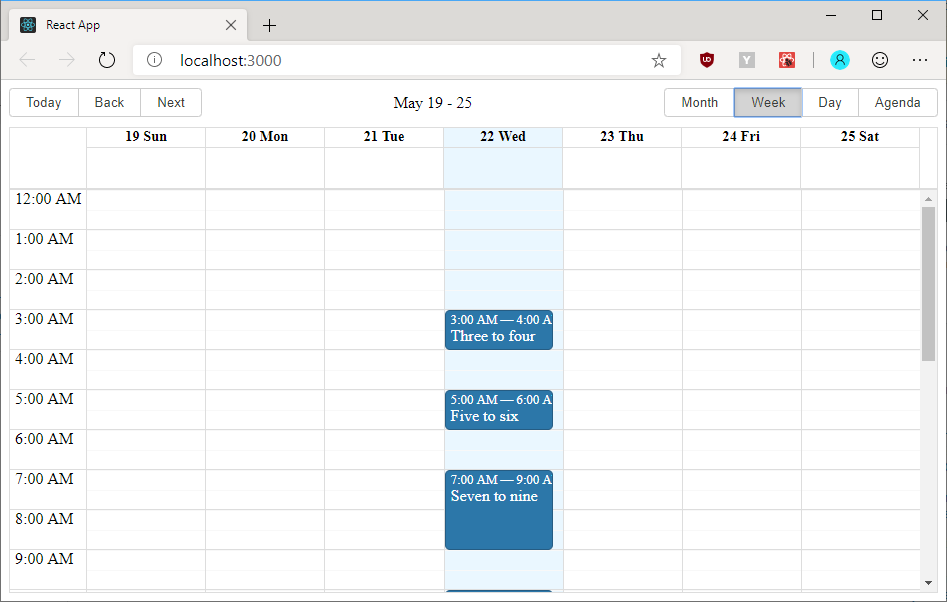
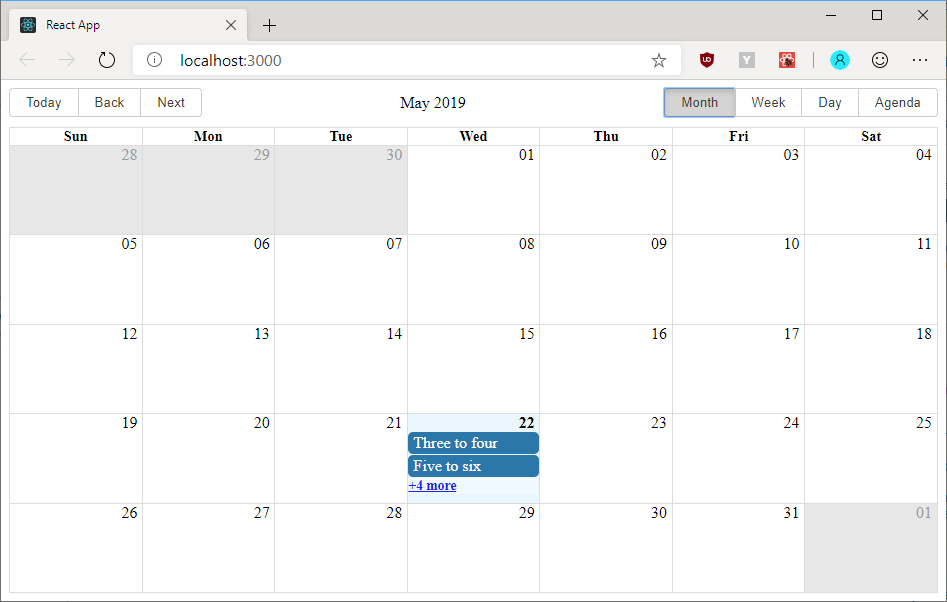

# React Big Calendar Month View Slot Grouping By Type

For a project I am working on, I need to have an option to adjust RBC to display
a different version of month view than it does by default. I am going to see if
I can prototype a standalone solution to that before I attempt to integrate the
changes needed to support it in my project.

By default, the RBC week view looks like this:

A month view containing the above week then looks like this:

In my project, slots of the calendar can have multiple types and are color-coded.
In the screenshots above, which come from the
[RBC demo app](http://intljusticemission.github.io/react-big-calendar/examples/index.html),
there is only one kind of a slot (in blue color).

The change I am looking to implement entails grouping all items of the same type
to a single slot and displaying the number of items in the group on that one
slot.

RBC month view will display up to three slots in a day cell of the month view.
Coincidentally, I know I will only ever have three types of slots in my application.
So after grouping, I should never run into a case where the *+X more* links gets
displayed. I can hide that using CSS, then, but the grouping itself I think I
will be best off doing using a custom implementation provided to one of the RBC's
`components` prop fields. I am not sure which one, yet.

I do not want to change the data model in the component which displays RBC as it
would require hoisting the logic which deals with view change and data restructuring
for the given view up. This is something I want to avoid as I consider the current
calendar view to be an encapsulated concern of the calendar component which
components which host it should have no information about unless they want to
hook additional logic up to that which affects their own state and presentation,
not just the calendars.

I'm going to start by scaffolding a new Create React App instance from a template.
`npx create-react-app . --typescript`.

CRA being annoying, it will require `README.md` and the image files to be temporarily
moved to another directory and then moved back after it has scaffolded its files,
because it is not smart enough to realize they would not conflict.

After scaffolding the application and cleaning it up a bit (removing useless files,
rewriting questionable syntax to a more appropriate way the way I view the world),
we are ready to integrate RBC into the project.

`npm install --save react-big-calendar moment` is followed by
`npm install --save-dev @types/react-big-calendar` because Moment bundles its
own types in its package, as it should. We need Moment because RBC won't work
without a localizer and Moment is the easiest choice for a demo like this one.

Do not forget to include RBC styles in `App.tsx` so that the calendar is not
broken.

With a few lines we can demonstrate a week view calendar with a number of events
and upon switching to the month view we see the preview + expansion link mode.

---

The next objective is to demonstrate slots of multiple kinds. We can get rid of
the default `Event` type and provide our own to RBC as the component is generic.
If we keep the names of the `start` and `end` fields, we do not need to provide
accessor props for it, so we will do that to keep things simple.

To render the slots differently based on the `kind` property, we need to implement
a custom `eventWrapper` `component` prop field. Since the `children` passed in
the `props` of that wrapper component are absolutely positioned (at least in the
week view), we cannot just wrap them in another `div` with a certain background
color, as it would end up stacked at the top of the week day column.

Instead, we will make use of `React.Children.only` and adjust the props of the
passed-in `div` to extend its `className`.

We can now verify both the week view and the month view show correctly color-
coded slots.

---
